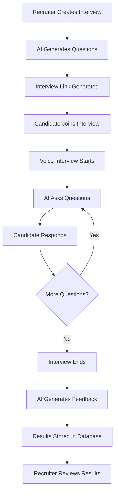

# AI Voice Recruiter - Documentation

## Table of Contents

1. [Project Overview](#project-overview)
2. [Features](#features)
3. [Technology Stack](#technology-stack)
4. [System Architecture](#system-architecture)
5. [Installation & Setup](#installation--setup)
6. [Project Structure](#project-structure)
7. [Database Schema](#database-schema)
8. [API Reference](#api-reference)
9. [Core Components](#core-components)
10. [Authentication Flow](#authentication-flow)
11. [Interview Process Flow](#interview-process-flow)
12. [Configuration](#configuration)
13. [Deployment](#deployment)
14. [Troubleshooting](#troubleshooting)
15. [Contributing](#contributing)

---

## Project Overview

**AI Voice Recruiter** is an innovative Next.js application that revolutionizes the recruitment process by conducting automated voice interviews using artificial intelligence. The system enables recruiters to create custom interviews, while candidates can participate in natural, conversational AI-powered interviews that are automatically evaluated and scored.

### Key Benefits

- **Automated Screening**: Reduces manual effort in initial candidate screening
- **Consistent Evaluation**: Ensures fair and standardized assessment across all candidates
- **Time Efficiency**: Conducts multiple interviews simultaneously
- **Natural Interaction**: Voice-based conversation feels more engaging than traditional forms
- **Instant Feedback**: Generates comprehensive feedback immediately after interviews

---

## Features

### For Recruiters

1. **Interview Creation**
   - Custom job positions and descriptions
   - Configurable interview duration (15-60 minutes)
   - Multiple interview types (Technical, Behavioral, Mixed)
   - AI-generated relevant questions

2. **Interview Management**
   - Dashboard with all created interviews
   - Real-time interview status tracking
   - Shareable interview links
   - Interview history and analytics

3. **Candidate Evaluation**
   - Automated feedback generation
   - Multi-dimensional scoring (Technical, Communication, Problem-solving, Experience)
   - Interview transcripts and recordings
   - Hiring recommendations

### For Candidates

1. **Voice Interview Experience**
   - Natural conversation with AI interviewer
   - Real-time voice interaction
   - Visual feedback during conversation
   - Supportive and encouraging tone

2. **Interview Features**
   - Hints and clarifications when needed
   - Professional yet friendly atmosphere
   - Immediate completion confirmation
   - Session timer

---

## Technology Stack

### Frontend
- **Framework**: Next.js 15.3.1 (App Router)
- **Language**: TypeScript 5.x
- **Styling**: Tailwind CSS v4
- **UI Components**: 
  - Radix UI primitives
  - shadcn/ui components
  - Lucide React icons
- **State Management**: React Context API
- **Theme**: next-themes for dark/light mode

### Backend & Services
- **Database**: Supabase (PostgreSQL)
- **Authentication**: Supabase Auth with Google OAuth
- **AI/ML Services**:
  - **OpenAI GPT-4**: Question generation and feedback analysis
  - **Vapi AI**: Voice conversation orchestration
  - **Deepgram Nova-2**: Speech-to-text transcription
  - **PlayHT**: Text-to-speech synthesis

### Development Tools
- **Build Tool**: Next.js built-in webpack
- **Linting**: ESLint 9
- **Package Manager**: npm/yarn
- **Version Control**: Git

---

## System Architecture

```
┌─────────────────────────────────────────────────────────────┐
│                         Client Side                          │
├─────────────────────────────────────────────────────────────┤
│                                                              │
│  ┌──────────────┐  ┌──────────────┐  ┌──────────────┐     │
│  │   Next.js    │  │   React      │  │  TypeScript  │     │
│  │   App Router │  │  Components  │  │              │     │
│  └──────────────┘  └──────────────┘  └──────────────┘     │
│                                                              │
└─────────────────────────────────────────────────────────────┘
                              │
                              ▼
┌─────────────────────────────────────────────────────────────┐
│                      API Layer (Next.js)                     │
├─────────────────────────────────────────────────────────────┤
│                                                              │
│  ┌──────────────┐  ┌──────────────┐  ┌──────────────┐     │
│  │  /api/ai-    │  │  /api/ai-    │  │   Server     │     │
│  │    model     │  │   feedback   │  │  Components  │     │
│  └──────────────┘  └──────────────┘  └──────────────┘     │
│                                                              │
└─────────────────────────────────────────────────────────────┘
                              │
                              ▼
┌─────────────────────────────────────────────────────────────┐
│                     External Services                        │
├─────────────────────────────────────────────────────────────┤
│                                                              │
│  ┌──────────────┐  ┌──────────────┐  ┌──────────────┐     │
│  │   Supabase   │  │   OpenAI     │  │    Vapi AI   │     │
│  │  Database &  │  │    GPT-4     │  │    Voice     │     │
│  │     Auth     │  │              │  │   Platform   │     │
│  └──────────────┘  └──────────────┘  └──────────────┘     │
│                                                              │
│  ┌──────────────┐  ┌──────────────┐                        │
│  │   Deepgram   │  │    PlayHT    │                        │
│  │     STT      │  │     TTS      │                        │
│  └──────────────┘  └──────────────┘                        │
│                                                              │
└─────────────────────────────────────────────────────────────┘
```

---

## Installation & Setup

### Prerequisites

- Node.js 18+ and npm/yarn
- Git
- Supabase account
- OpenAI API key
- Vapi AI account

### Step 1: Clone the Repository

```bash
git clone <repository-url>
cd ai_voice_recruiter
```

### Step 2: Install Dependencies

```bash
npm install
# or
yarn install
```

### Step 3: Environment Configuration

Create a `.env.local` file in the root directory:

```env
# Supabase Configuration
NEXT_PUBLIC_SUPABASE_URL=your_supabase_project_url
NEXT_PUBLIC_SUPABASE_ANON_KEY=your_supabase_anon_key

# OpenAI Configuration
OPENAI_API_KEY=your_openai_api_key

# Vapi AI Configuration
NEXT_PUBLIC_VAPI_PUBLIC_KEY=your_vapi_public_key

# Application Configuration
NEXT_PUBLIC_HOST_URL=http://localhost:3000/interview
```

### Step 4: Database Setup

1. Create a Supabase project
2. Run the following SQL to create required tables:

```sql
-- Interviews table
CREATE TABLE interviews (
    id SERIAL PRIMARY KEY,
    interview_id UUID DEFAULT gen_random_uuid(),
    userEmail VARCHAR(255) NOT NULL,
    userName VARCHAR(255),
    jobPosition VARCHAR(255) NOT NULL,
    jobDescription TEXT,
    duration VARCHAR(50),
    type TEXT[],
    questionList JSONB,
    created_at TIMESTAMP DEFAULT NOW()
);

-- Interview Feedback table
CREATE TABLE "Interview-Feedback" (
    id SERIAL PRIMARY KEY,
    interview_id UUID REFERENCES interviews(interview_id),
    userName VARCHAR(255),
    userEmail VARCHAR(255),
    feedback JSONB,
    recommended BOOLEAN DEFAULT false,
    created_at TIMESTAMP DEFAULT NOW()
);

-- Indexes for performance
CREATE INDEX idx_interviews_email ON interviews(userEmail);
CREATE INDEX idx_feedback_interview_id ON "Interview-Feedback"(interview_id);
```

3. Enable Row Level Security (RLS) and configure policies as needed

### Step 5: Run the Development Server

```bash
npm run dev
# or
yarn dev
```

Open [http://localhost:3000](http://localhost:3000) to access the application.

---

## Project Structure

```
ai_voice_recruiter/
├── app/                          # Next.js app directory
│   ├── (auth)/                   # Authentication routes
│   │   └── signin/               # Sign-in page
│   ├── (main)/                   # Main authenticated routes
│   │   ├── dashboard/            # Dashboard and interview creation
│   │   │   ├── components/       # Dashboard components
│   │   │   └── create-interview/ # Interview creation flow
│   │   ├── all-interview/        # All interviews list
│   │   └── scheduled-interview/  # Scheduled interview details
│   ├── api/                      # API routes
│   │   ├── ai-feedback/          # Feedback generation endpoint
│   │   └── ai-model/             # Question generation endpoint
│   ├── interview/                # Interview execution routes
│   │   └── [interview_id]/       # Dynamic interview routes
│   │       ├── live/             # Live interview session
│   │       └── completed/        # Interview completion page
│   ├── components/               # App-level components
│   ├── types/                    # TypeScript type definitions
│   ├── layout.tsx                # Root layout
│   ├── page.tsx                  # Home page
│   └── globals.css               # Global styles
├── components/                   # Shared UI components
│   └── ui/                       # shadcn/ui components
├── context/                      # React Context providers
│   ├── InterviewDetailContext.tsx
│   └── UserDetailContext.tsx
├── hooks/                        # Custom React hooks
├── lib/                          # Utility functions
├── services/                     # External service integrations
│   ├── Interview.tsx             # Interview service
│   ├── Prompts.ts                # AI prompt templates
│   └── supabaseClient.ts         # Supabase client
├── public/                       # Static assets
├── .env.local                    # Environment variables
├── next.config.ts                # Next.js configuration
├── package.json                  # Dependencies
├── tailwind.config.ts            # Tailwind configuration
└── tsconfig.json                 # TypeScript configuration
```

---

## Database Schema

### Tables

#### 1. `interviews`
Stores interview session information

| Column | Type | Description |
|--------|------|-------------|
| id | SERIAL | Primary key |
| interview_id | UUID | Unique interview identifier |
| userEmail | VARCHAR(255) | Creator's email |
| userName | VARCHAR(255) | Candidate's name |
| jobPosition | VARCHAR(255) | Job position title |
| jobDescription | TEXT | Detailed job description |
| duration | VARCHAR(50) | Interview duration |
| type | TEXT[] | Interview types array |
| questionList | JSONB | Generated questions |
| created_at | TIMESTAMP | Creation timestamp |

#### 2. `Interview-Feedback`
Stores interview results and feedback

| Column | Type | Description |
|--------|------|-------------|
| id | SERIAL | Primary key |
| interview_id | UUID | Foreign key to interviews |
| userName | VARCHAR(255) | Candidate's name |
| userEmail | VARCHAR(255) | Candidate's email |
| feedback | JSONB | AI-generated feedback |
| recommended | BOOLEAN | Hiring recommendation |
| created_at | TIMESTAMP | Feedback generation time |

---

## API Reference

### 1. Generate Interview Questions

**Endpoint**: `POST /api/ai-model`

**Description**: Generates interview questions based on job details

**Request Body**:
```json
{
  "jobPosition": "Software Engineer",
  "jobDescription": "Full-stack development role...",
  "duration": "30",
  "type": ["Technical", "Behavioral"]
}
```

**Response**:
```json
{
  "status": 200,
  "message": {
    "content": {
      "interviewQuestions": [
        {
          "question": "Tell me about your experience with React",
          "type": "Technical"
        }
      ]
    }
  }
}
```

### 2. Generate Interview Feedback

**Endpoint**: `POST /api/ai-feedback`

**Description**: Analyzes interview conversation and generates feedback

**Request Body**:
```json
{
  "conversation": [
    {
      "role": "assistant",
      "content": "Welcome to your interview..."
    },
    {
      "role": "user",
      "content": "Thank you, I'm excited..."
    }
  ]
}
```

**Response**:
```json
{
  "status": 200,
  "message": {
    "content": {
      "feedback": {
        "rating": {
          "technicalSkills": 8,
          "communication": 9,
          "problemSolving": 7,
          "experience": 8
        },
        "summary": "Strong technical foundation...",
        "recommendation": "Recommended",
        "recommendationMsg": "Excellent candidate for the role"
      }
    }
  }
}
```

---

## Core Components

### 1. Interview Creation Flow

```typescript
// app/(main)/dashboard/create-interview/components/Form.tsx
- Collects job details
- Validates input
- Triggers question generation
```

### 2. Live Interview Session

```typescript
// app/interview/[interview_id]/live/page.tsx
- Initializes Vapi voice assistant
- Manages conversation state
- Handles voice interactions
- Triggers feedback generation on completion
```

### 3. Dashboard Components

```typescript
// app/(main)/dashboard/components/
- CreateOptions.tsx: Quick actions for interview creation
- InterviewCard.tsx: Interview summary cards
- LatestInterviewsList.tsx: Recent interviews display
- WelcomeContainer.tsx: User greeting and stats
```

### 4. Context Providers

```typescript
// context/InterviewDetailContext.tsx
- Manages interview session data
- Provides interview info across components

// context/UserDetailContext.tsx
- Manages user authentication state
- Provides user data globally
```

---

## Authentication Flow

1. **Initial Access**: User lands on the home page
2. **Sign In**: Redirected to `/signin` for authentication
3. **Google OAuth**: User authenticates via Google
4. **Supabase Auth**: Token stored and session created
5. **Dashboard Access**: User redirected to `/dashboard`
6. **Protected Routes**: Middleware checks authentication status

---

## Interview Process Flow



---

## Configuration

### Tailwind Configuration
Located in `tailwind.config.ts`, customizes design system:
- Custom colors
- Animation utilities
- Responsive breakpoints
- Dark mode support

### Next.js Configuration
Located in `next.config.ts`:
- API routes configuration
- Image optimization
- Environment variables
- Build optimizations

### TypeScript Configuration
Located in `tsconfig.json`:
- Strict mode enabled
- Path aliases configured
- Module resolution settings

---

## Deployment

### Vercel Deployment (Recommended)

1. Push code to GitHub
2. Connect repository to Vercel
3. Configure environment variables
4. Deploy

```bash
vercel --prod
```

### Docker Deployment

Create `Dockerfile`:

```dockerfile
FROM node:18-alpine AS deps
WORKDIR /app
COPY package*.json ./
RUN npm ci --only=production

FROM node:18-alpine AS builder
WORKDIR /app
COPY . .
RUN npm ci
RUN npm run build

FROM node:18-alpine AS runner
WORKDIR /app
ENV NODE_ENV production
COPY --from=builder /app/.next ./.next
COPY --from=builder /app/public ./public
COPY --from=deps /app/node_modules ./node_modules
COPY package.json ./

EXPOSE 3000
CMD ["npm", "start"]
```

### Manual Deployment

1. Build the application:
```bash
npm run build
```

2. Start production server:
```bash
npm start
```

---

## Troubleshooting

### Common Issues

#### 1. Vapi Connection Issues
- **Problem**: Voice interview doesn't start
- **Solution**: Check Vapi API key and network connectivity

#### 2. Database Connection Errors
- **Problem**: Cannot fetch/save interview data
- **Solution**: Verify Supabase URL and anon key

#### 3. OpenAI API Errors
- **Problem**: Questions/feedback not generating
- **Solution**: Check API key and rate limits

#### 4. Audio Issues
- **Problem**: Microphone not working
- **Solution**: Ensure browser permissions are granted

### Debug Mode

Enable debug logging:

```typescript
// Add to .env.local
NEXT_PUBLIC_DEBUG=true
```

---

## Contributing

### Development Workflow

1. Fork the repository
2. Create a feature branch
3. Make your changes
4. Write/update tests
5. Submit a pull request

### Code Style Guidelines

- Use TypeScript for all new code
- Follow ESLint configuration
- Write meaningful commit messages
- Add JSDoc comments for complex functions
- Update documentation for new features

### Testing

```bash
# Run linting
npm run lint

# Type checking
npm run type-check

# Run tests (when implemented)
npm test
```

---

## Security Considerations

1. **API Keys**: Never commit API keys to version control
2. **Database Access**: Use Row Level Security in Supabase
3. **Input Validation**: Validate all user inputs
4. **Rate Limiting**: Implement rate limiting for API endpoints
5. **CORS**: Configure appropriate CORS policies

---

## Performance Optimization

1. **Code Splitting**: Utilize Next.js automatic code splitting
2. **Image Optimization**: Use Next.js Image component
3. **Caching**: Implement appropriate caching strategies
4. **Database Queries**: Optimize database queries with indexes
5. **Bundle Size**: Monitor and optimize bundle size

---

## Future Enhancements

- [ ] Video interview support
- [ ] Multi-language support
- [ ] Advanced analytics dashboard
- [ ] Integration with ATS systems
- [ ] Mobile application
- [ ] Batch interview scheduling
- [ ] Custom AI model training
- [ ] Interview recording playback

---

## Support & Contact

For issues, questions, or contributions:
- Create an issue on GitHub
- Contact the development team
- Check the documentation

---

## License

This project is proprietary software. All rights reserved.

---

*Last Updated: February 2025*
*Version: 0.1.0*
